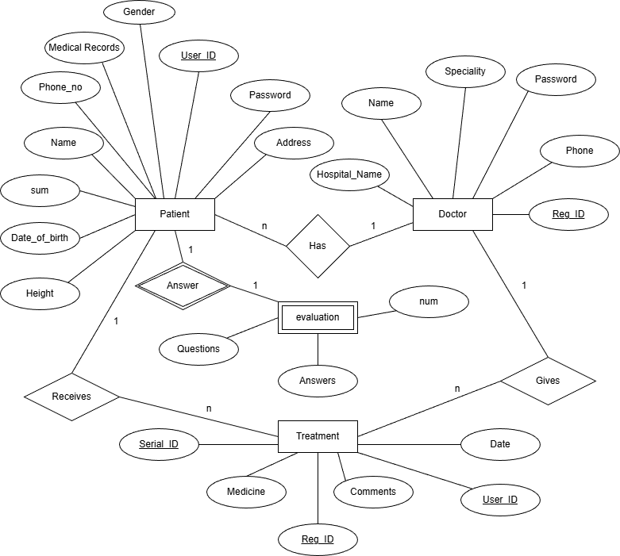
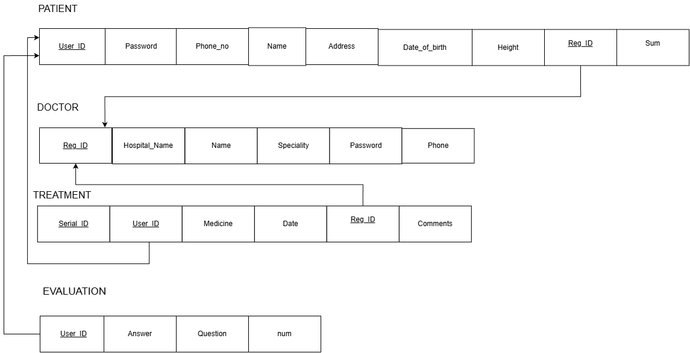

# 🧠 Mental Health Assessment System

A web-based **Mental Health Assessment System** developed for the course
CSE370 -- Database Systems (Summer 2024).

This system enables structured interaction between doctors and patients
for mental health evaluation, treatment management, and record tracking
using a relational database design.

------------------------------------------------------------------------
## 📖 Project Overview

The **Mental Health Assessment System** provides:

-   Secure authentication for doctors and patients\
-   Role-based dashboards\
-   Patient treatment management\
-   Doctor evaluation system\
-   Structured relational database backend

------------------------------------------------------------------------

## 🗂️ System Features

### 👤 Patient Module

-   Patient Sign Up\
-   Patient Sign In\
-   Patient Dashboard\
-   View Treatment Details\
-   View Evaluation Results

### 👨‍⚕️ Doctor Module

-   Doctor Sign In\
-   Doctor Dashboard\
-   Add / Manage Treatments\
-   Evaluate Patients\
-   View Patient Evaluation Records

------------------------------------------------------------------------

## 🧱 Database Design

### 📌 ER / EER Diagram

The ER diagram defines: - Entities (Patient, Doctor, Treatment,
Evaluation) - Relationships - Primary and Foreign Keys - Attribute
structure

------------------------------------------------------------------------

### 📌 Schema Diagram

The schema diagram represents: - Table structures - Data types - Keys
and constraints - Relationship mappings

------------------------------------------------------------------------

## 🛠️ Technologies Used

-   Relational Database Management System (RDBMS)
-   SQL
-   ER Modeling Tools
-   Web-based Interface (Frontend + Backend)

------------------------------------------------------------------------

## 📂 Project Structure

    Mental-Health-Assessment-System/
    │
    ├── images/
    │   ├── er_diagram.png
    │   └── schema_diagram.png
    │
    ├── sql/
    ├── src/
    └── README.md

------------------------------------------------------------------------

## 🎯 Learning Outcomes

-   Designing ER/EER diagrams
-   Converting ER model to relational schema
-   Implementing SQL constraints
-   Managing relationships between entities
-   Understanding normalization and data integrity

------------------------------------------------------------------------

## 🚀 Future Improvements

-   Password hashing & secure authentication\
-   Role-based authorization\
-   Automated mental health scoring system\
-   Appointment scheduling\
-   Analytics dashboard\
-   Cloud deployment

------------------------------------------------------------------------

## 📜 License

This project was developed for academic purposes under the CSE370
Database Systems course.
